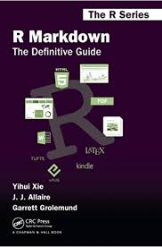
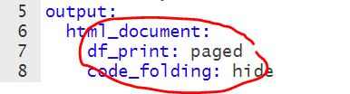
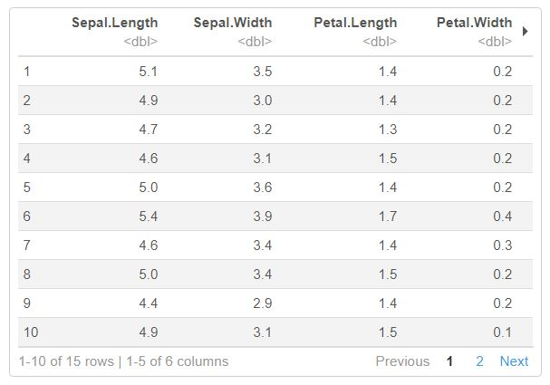
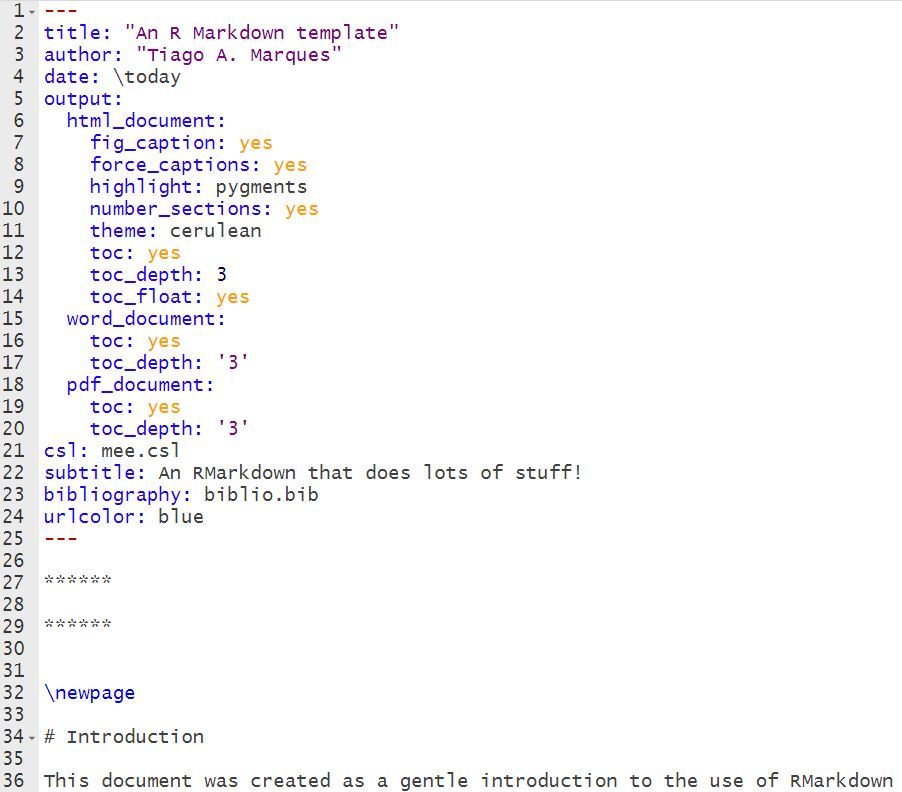
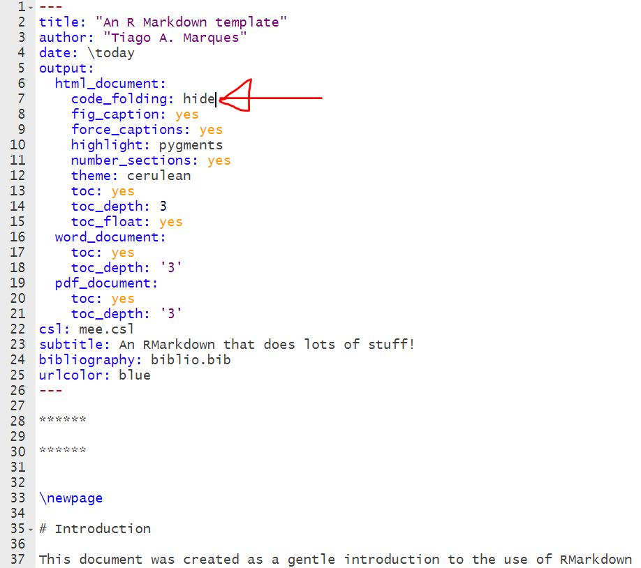

******

******


\newpage
## Please find adjoining code at <https://github.com/selsiekiely/CARMMHApapersSI_Pmac/tree/sperm-whale-recovery>.

# Introduction

Sperm Whale populations in the Gulf of Mexico have been negatively impacted by anthropogenic effects throughout history. This statistical paper is one positive human impact in the wake of conservation efforts to restore the Gulf of Mexico after 490000m**3 of crude oil was spilled from the Deep Water Horizon Oil Rig in April 2010. Unusual Mortality Rates were recorded with higher than average strandings of Sperm Whales[NOAA, 2021] and an unknown death toll lost at sea. Little monitoring of population numbers prior to the spill was carried out`      but with highly sophisticated new statistical software we are able to use existing spatial density models to predict pre-spill population counts.

# Method

Our objective is to predict whether the sperm whale (Physeter macrocephalus) population in the US Gulf of Mexico had recovered from historical commercial whaling prior to the Deepwater Horizon oil spill in April 2010. We assume that the population was at carrying capacity prior to the onset of commercial whaling in the Gulf of Mexico, and hypothesize that this carrying capacity was equal to the abundance for this area estimated by [Roberts et al. 2016, 7] based on spatial modelling of line transect data.  We start the population in year 1788 at this abundance, project the population forward using a population dynamics model including whaling harvest (see below) and see if it recovers to the initial population size by 2010.  We include uncertainty on the initial abundance and demographic parameters by running multiple simulations, and sampling from distributions of inputs representing the uncertainty; we do not include uncertainty on harvest numbers.

To do the computations, existing code from Tiago A Marques [Marques 2022], implementing a deterministic, age-and sex-structured discrete-time model for common bottlenose dolphins’ (Tusiorps Truncatus) response to the oil spill [Schwacke et al. In press], was adapted by Marques for offshore species including sperm whales.  This will be adapted by adding harvest. To do this, we need to make assumptions about which ages and sexes the harvest applied to.  We lay out some scenarios below, to receive feedback on them.

Sperm whaling in the Gulf of Mexico primarily took place seasonally, in the months of January to July [Reeves 2011, 41]. Suggested harvesting scenarios are as follows.


# Basic RMarkdown tricks

First, we load the `knitr` package that can be of help:

```{r}
library(knitr)
```

```{r}
library(readxl)
SpeciesDefinitionFile <- read_excel("C:/Users/Sophia/CARMMHApapersSI/FolderArchitecture2runCode/InputFiles/SpeciesDefinitionFile.xlsx")
View(SpeciesDefinitionFile)
```

```{r}
#Load library to do matrix population modelling
library(popbio)
#Load code files from Tiago
source("C:/Users/Sophia/CARMMHApapersSI/buildPPM.R")
source("C:/Users/Sophia/CARMMHApapersSI/GetStablePop.R")
source("C:/Users/Sophia/CARMMHApapersSI/getSpData.R")
#Load code file from Tiago adapted by Len to add harvest
source("C:/Users/Sophia/CARMMHApapersSI/RunSpWithHarvest.R")

#Load the sperm whale population parameters from a spreadsheet
Pmac <- getSpData("Pmac", file ="SpeciesDefinitionFile.xlsx") 

#Set the inter-birth interval required to give a stable population
#This is the value that Tiago found worked, which is slightly different from that of Lance's
Pmac$ibnom <- 6.236487

#Number of years to run model forward
# 1788 was the first year of documented harvest in the Reeves paper
# Their effort plot is decadal, starting in 1785, so I'll start from then, and assume whaling started that year
# DWH oil spill was in 2010, so run through to 2010.
# Total run, therefore is from 1785 to 2010 - 226 years
n.years <- 226 
```

## Scenario 1 - best guess scenario

The harvest is proportional to the numbers in each age- and sex-class except the 1st age class - calves are not targeted.
```{r}
hScenario <- 1
runPopSims(Sp = Sp, nsims = nsims, nyears = nyears, seed = 7134672,
           harvest = harvest, hScenario = hScenario)
load(file=paste0("InOutBySp/", SpInfo$folder, "/", Sp, "simres", nsims, "Sim.RData"))
s1res = matrix(NA, ncol = nyears, nrow = nsims)
for(i in 1:nsims) {
  s1res[i, ] = colSums(simres[, , i, 2])
}
```

## Scenario 2 - best case (smallest take, biggest pop size, proportional harvest)


```{r}
hScenario <- 1
#Create larger population size, temporarily
# Note - best to back up the N_boot.csv file!
Nfile <- paste0("InOutBySp/", SpInfo$folder, "/N_boot.csv")
Nstart <- read.csv(Nfile, header = TRUE)
Nstart.larger <- Nstart * (1 / 0.35)
#Replace N_boot file, temporarily
write.csv(Nstart.larger$x, Nfile)
#Run sim
runPopSims(Sp = Sp, nsims = nsims, nyears = nyears, seed = 7134672,
           harvest = harvest, hScenario = hScenario)
#Put back old N_boot numbers
write.csv(Nstart$x, Nfile)
load(file=paste0("InOutBySp/", SpInfo$folder, "/", Sp, "simres", nsims, "Sim.RData"))
s2res = matrix(NA, ncol = nyears, nrow = nsims)
for(i in 1:nsims) {
  s2res[i, ] = colSums(simres[, , i, 2])
}

ylims <- range(c(s2res))
plot(s2res[i, ], type = "n", ylim = ylims, xlab = "Year", ylab = "Predicted population size", las = 1, main = "Best case")
for(i in 1:nsims){
  lines(s2res[i, ], type = "l", lwd = 0.7, col = rgb(0, 0, 0, 0.15))
}
lines(colMeans(s2res), type = "l", lwd = 3, col = "#1b2ac8")  

```
## dont know what below is
```{r}
hScenario <- 1
runPopSims(Sp = Sp, nsims = nsims, nyears = nyears, seed = 7134672,
           harvest = harvest, hScenario = hScenario)
load(file=paste0("InOutBySp/", SpInfo$folder, "/", Sp, "simres", nsims, "Sim.RData"))
s1res = matrix(NA, ncol = nyears, nrow = nsims)
for(i in 1:nsims) {
  s1res[i, ] = colSums(simres[, , i, 2])
}


ylims <- range(c(s1res))
plot(s1res[i, ], type = "n", ylim = ylims, xlab = "Year", ylab = "Predicted population size", las = 1, main = "Best guess")
for(i in 1:nsims){
  lines(s1res[i, ], type = "l", lwd = 0.7, col = rgb(0, 0, 0, 0.15))
}
lines(colMeans(s1res), type = "l", lwd = 3, col = "#1b2ac8")  
```


#Scenario 3 - worst case (largest take, smallest pop size, harvest more on females)

The harvest is proportional to the numbers in each age- and sex-class except calves, and males 21 and older not harvested. This is to account for the possibility of males travelling out of the Gulf of Mexico during part of whaling season and solitary moving whales not a target for whaling vessels. Harvest is more on females which is the worse case scenario for the whales survival.

```{r}
hScenario <- 2
runPopSims(Sp = Sp, nsims = nsims, nyears = nyears, seed = 7134672,
           harvest = harvest * 2, hScenario = hScenario)
load(file=paste0("InOutBySp/", SpInfo$folder, "/", Sp, "simres", nsims, "Sim.RData"))
s3res = matrix(NA, ncol = nyears, nrow = nsims)
for(i in 1:nsims) {
  s3res[i, ] = colSums(simres[, , i, 2])

ylims <- range(c(s3res))
plot(s3res[i, ], type = "n", ylim = ylims, xlab = "Year", ylab = "Predicted population size", las = 1, main = "Worst case")
for(i in 1:nsims){
  lines(s3res[i, ], type = "l", lwd = 0.7, col = rgb(0, 0, 0, 0.15))
}
lines(colMeans(s3res), type = "l", lwd = 3, col = "#1b2ac8")  

```

## Altogether Now

```{r}
#plot the results
par(mfrow = c(3, 1))

ylims <- range(c(s1res))
plot(s1res[i, ], type = "n", ylim = ylims, xlab = "Year", ylab = "Predicted population size", las = 1, main = "Best guess")
for(i in 1:nsims){
  lines(s1res[i, ], type = "l", lwd = 0.7, col = rgb(0, 0, 0, 0.15))
}
lines(colMeans(s1res), type = "l", lwd = 3, col = "#1b2ac8")  

ylims <- range(c(s2res))
plot(s2res[i, ], type = "n", ylim = ylims, xlab = "Year", ylab = "Predicted population size", las = 1, main = "Best case")
for(i in 1:nsims){
  lines(s2res[i, ], type = "l", lwd = 0.7, col = rgb(0, 0, 0, 0.15))
}
lines(colMeans(s2res), type = "l", lwd = 3, col = "#1b2ac8")  

ylims <- range(c(s3res))
plot(s3res[i, ], type = "n", ylim = ylims, xlab = "Year", ylab = "Predicted population size", las = 1, main = "Worst case")
for(i in 1:nsims){
  lines(s3res[i, ], type = "l", lwd = 0.7, col = rgb(0, 0, 0, 0.15))
}
lines(colMeans(s3res), type = "l", lwd = 3, col = "#1b2ac8")  

par(mfrow = c(1, 1))
```


## Finding help online

There are so many resources online that is hard to list just a few, but just in case:

* An RStudio course on RMarkdown is here: https://rmarkdown.rstudio.com/lesson-1.html

At the corresponding RMarkdown sheat sheets are here:

* Here is the [link](https://rstudio.com/wp-content/uploads/2016/03/rmarkdown-cheatsheet-2.0.pdf) 

As you can seen, these are two different ways of providing links in RMarkdown!

A [free access definitive guide on RMarkdown](https://bookdown.org/yihui/rmarkdown/) by Yihui Xie, J. J. Allaire and  Garrett Grolemund is also here. If you don't find what you need there, you are really looking for something out of the ordinary:

Finaly, [Pimp my RMD: a few tips for R Markdown](https://holtzy.github.io/Pimp-my-rmd/)
by Yan Holtz contains several tips and tricks that might be useful.

## It is dynamic

To get us going we first generate two datasets in this folder, using an existing R data set.

```{r}
write.table(file="cars1to10.txt",cars[1:10,])
write.table(file="cars11to20.txt",cars[11:20,])
```

This allows us to confirm that the exact same code will produce different dynamic results, as a consequence of changing the data we are using.

The plot below will use the object `mydata` to make a plot.

```{r}
mydata <- read.table(file="cars1to10.txt")
plot(mydata)
```

The maximum value for `speed` in this file is `r max(mydata$speed)`. Note this is a dynamic value, we have not really written that number in the .Rmd text. Check the .Rmd to see how that is done,

Now, if after a while your collaborator sends you a new data set, in the non-reproducible research world you would ave to repeate it all. Not here. You just have to read the new data in and the exact same code can be used, now producing diferent results.


```{r}
mydata <- read.table(file="cars11to20.txt")
plot(mydata)
```

The maximum value for `speed` in this file is now `r max(mydata$speed)`. Dynamic values rock!

As an example, you can even print here when this document was compiled. This was compiled on `r date()`.

## Hyde and seek

We might want to show code and then the output of it

```{r}
a <- 3
b <- 4
a+b
```

but we might also just want to show code and no output

```{r,eval=FALSE}
a <- 3
b <- 4
a+b
```

or vice versa, just the output

```{r,eval=TRUE,echo=FALSE}
a <- 3
b <- 4
a+b
```

Note there are many such parameters that you can tweak in the code chuck headers, and you can find them in the cheat sheet I provided a link above for. 

# Adding References

One of the big dramas of large reports and thesis are generating references, properly formatted.

That is straingtforward in RMarkdown. This template shows you a way to do so, but you might consider exploring other alternatives. 

You need a file that contains the references (a bib file) and optionally a file that formats the references (I provide the mee.cls as an example). So here we use:

* biblio.bib
* mee.cls

Then, each time you want to cite a reference, you need to have it in the .bib file. For that I recomend using JABREF (https://www.jabref.org/), but any reference manager that can generate bibtex files will do. Each reference has associated with it a "BibtexKey". Then you just use that with an "@" in front to cite that reference.

As an example, here is a citation, a great resource for GLMs is @Faraway2006, and a good introduction to GAMs is @Wood2006. Ecological regression examples can be found in @Zuur2009b.

As you will see, these references will be present at the end of the document, in a suitably named section (I used "References"!).

Note that if there are funny characters in the .bib file you might face compiling problems!

If you need additional guidance in this process, there is a holding hands document called "StepByStep.pptx" that has a visual tutorial of all these steps with computer screenshots of what needs to be done to make this work. This should be fool proof. If you have any trouble with it please report and I'll update this document.

# Figures and Tables

## Figures

As you have seen above, we can include figures easily as outputs from R

```{r}
plot(rnorm(100))
```

However, we can actually include external images easily:



## Tables

If you want to include a table, you might just print it

```{r}
head(iris,15)
```

but that looks, let's face it, rather horrible. The next bext thing is to consider changing the yaml, and adding something to the html output `df_print: paged`, as in



Try it and you will get something like this



Another option be to explore the `kable` fuction, from package `knitr`, to help formating the table

```{r}
kable(cars,caption="A table with the dataset cars")
```

There are much fancier table types, and additional packages for table formatting. Take a peak e.g. here:

https://rfortherestofus.com/2019/11/how-to-make-beautiful-tables-in-r/

If you care to make an example using some of the additional table formatting packages found there (including `DT`,`gt`,`kableExtra`, `formattable`, `reactable` and/or `flextable`) please consider contributing it to this document. The tables you get from using `reactable` seem especially fancy, but getting them up and running seems to require some time investment.


# About output format

This template can be knited into an html, a pdf or word document. 

For pdfs you might need additional software installed like a Latex system.

We are currently it is optimized for html, so it might require minor tweaking for rendering pdf and word with optimal format. As an example of minor formatting differences depending on the compiling considered, in the pdf the date of compilation is outputed by default in the header, while that does not happen in the html.

The header of an .Rmd file contains yaml that allows one to control the document. There are many many features that you can costumize. 

Just as an example, try to add a line that says `code_folding: hide` and then try `code_folding: show`, so go from this



to this



and then compare what happens to the code in the html.

Note that you can control the output of each of the html, pdf and word documents separately, by changing arguments under the sub-headings under the `output:` heading, `html_document`, `word_document` and `pdf_document`, respectively.

# Contributors

Many folks have provided inputs and requests that have improved this document. 

If you have sent me inputs your name should be listed here. If it is not, plese complain!
